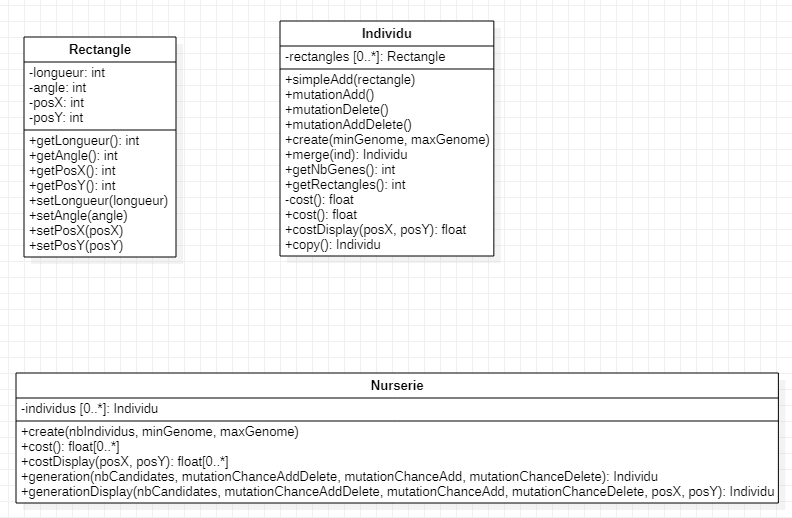
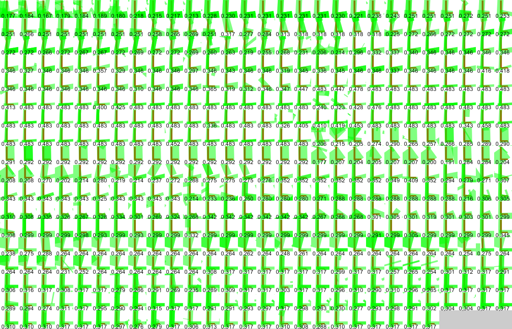

Programme implémentant un algorithme génétique pour créer une image vectorielle à partir d'une grille de pixels sur Processing Python

## Illustrations

Diagramme de classes:

Différents individus et leurs scores:

